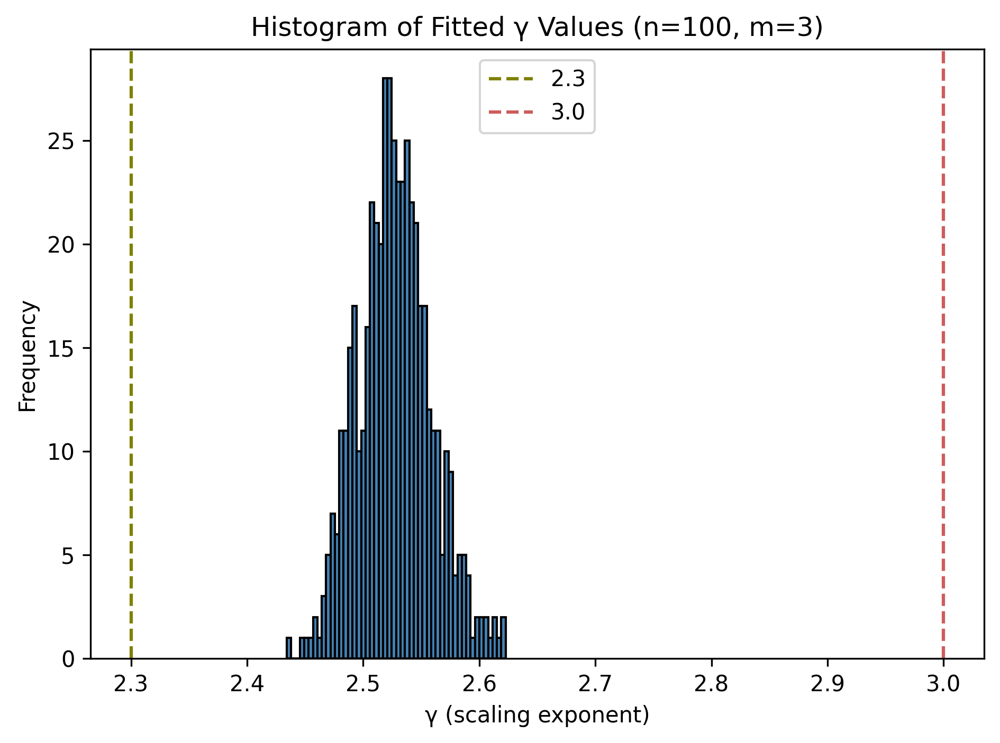
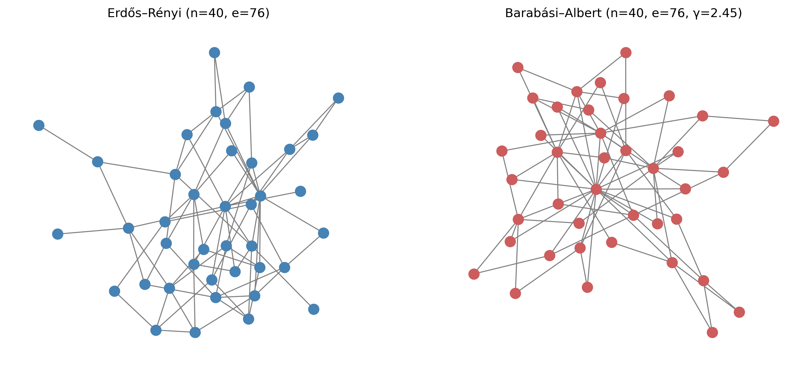
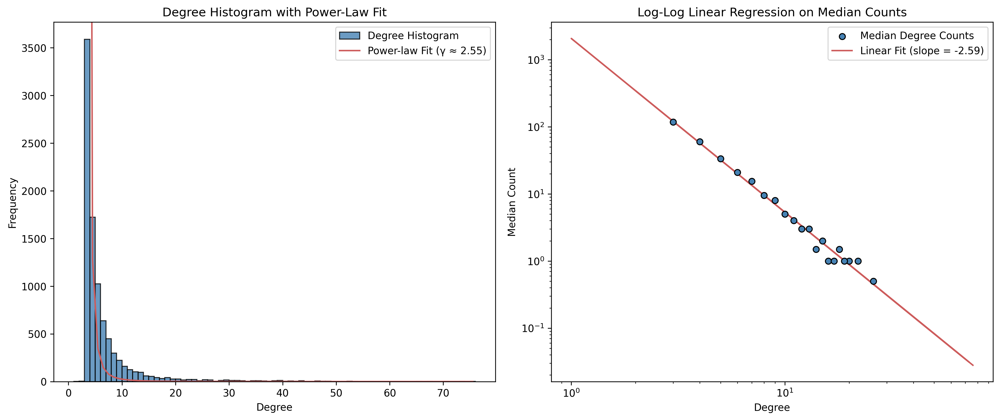

# Network Generation

The affective polarization algorithm is a network algorithm that modifies node attributes representing individual opinions. We begin, therefore, by generating a network. Specifically, we will be using the Erdős-Rényi model and the Barabási-Albert model. The former provides us a **uniform random graph** as a structureless baseline for comparison to isolate the effects of different network structures. The latter provies us with a **scale-free random graph** to study the effects the scale-free property has on opinion dynamics. The Barabási-Albert model uses a process of **preferential attachment** to produce a simple connected graph with a **power-law** (or "rich-get-richer") degree distribution:

$$p(k) \sim k^{-\gamma},\quad\mathbb{P}(2.3 \leq \gamma \leq 3) \approx 1$$

The scaling exponent $\gamma$ will be one of the most important measures for determining how network structure influences polarization.

## Scale-Free Networks

A graph is said to have the scale-free property when its structure looks statistically similar at different scales of observation. In such graphs, a small number of nodes have very high degrees, acting as hubs, while the vast majority of nodes have relatively few connections. This uneven distribution of connections remains consistent even if one examines only a subset of the graph or zooms out to view the entire network.

The scale-free property is closely associated with degree distributions that follow a power law. Formally, a graph is said to exhibit a power-law degree distribution if the probability $P(k)$ that a randomly chosen node has degree $k$ satisfies $P(k) \sim k^{-\gamma}$ for some constant exponent $\gamma > 1$. This relationship implies that while most nodes have small degrees, a few nodes have very large degrees, and the probability of encountering a node of degree $k$ decays polynomially rather than exponentially. The scale-free property thus reflects the invariance of the degree distribution under rescaling, with the functional form $k^{-\gamma}$ preserved across different levels of observation.

The Barabási–Albert model is commonly used to study scale-free networks because it generates graphs whose degree distributions approximate a power law. As the network grows according to its attachment mechanism, the resulting structure exhibits the key feature of scale-free graphs: a small number of highly connected nodes alongside many nodes with few connections. The Barabási–Albert model thus provides a simple generative framework that reproduces the characteristic statistical self-similarity of scale-free degree distributions observed in many real-world networks.

While the Barabási–Albert model provides a convenient way to generate scale-free networks, our interest is not in the model itself, but in the structural properties of the networks it produces. We use the BA model as a tool to generate graphs that approximate real-world systems, particularly those exhibiting scale-free degree distributions. In particular, we focus on graphs where the degree distribution exponent $\gamma$ falls between 2.3 and 3.0, consistent with the range observed in many empirical studies of social networks. When $n$ is sufficiently large, the mean value of the power-law exponent $\gamma$ for Barabási–Albert graphs approaches 3. However, our $n$ is bounded above by $e^{2m}$ and may be significantly less than that. Therefore, it is important to determine what $\gamma$ values BA graphs will have within the range of $n$ that we will be working with.

So, now that we know the range of values for which it is possible for ER and BA graphs to be of the same size and order and also that the vast majority of ER graphs will be connected while the vast majority of BA graphs (which are always connected) will have $2.3\leq\gamma\leq 3.0$; we can easily generate such graphs.

Our `generate_networks` function takes the number of nodes $n$, calculates the smallest value of $m$ that will generate a number of edges in a BA above the connectivity threshold for an ER graph, then generate those graphs, keeping only those that are connected (in the case of ER) with a $\gamma$ between 2.3 and 3.0 (in the case of BA).

A power-law distribution appears linear when plotted on logarithmic scales for both the x-axis and y-axis.

$$P(k) \sim k^{-\gamma} \longrightarrow \log P(k) \sim -\gamma \log k$$

As a result, the data points form a straight line on a log-log plot, with a slope equal to $-\gamma$, making it easy to visually identify power-law behavior. In the case of Barabási–Albert graphs, this implies that their degree distributions, when plotted on log-log axes, should display an approximately straight line, confirming the presence of scale-free structure.