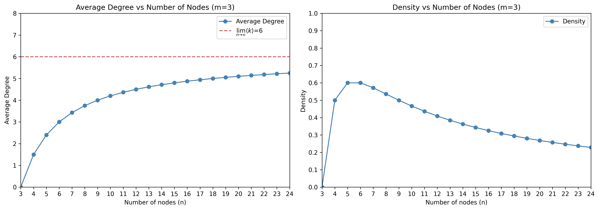
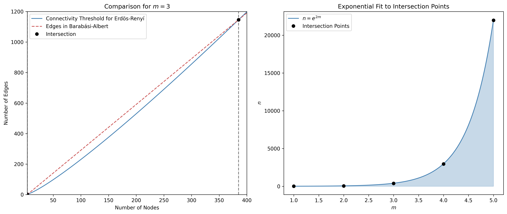

# Null Model

As with all mathematical models, we need a baseline of comparison. If we wish to understand how a scale-free network structure influences opinion dynamics, then we need to not only have a network that exhibits that specific structure, as in the **Barabási–Albert Model**, but also a network that does not exhibit any structure, a uniform random graph, as in the **Erdős-Rényi Model**. However, it is not enough that our null model not exhibit any structure. It must also be similar to the model it is being compared to, such as in the number of nodes, the number of edges and whether or not it is connected. Because both Barabási–Albert and Erdős-Rényi can be constructed using the number of nodes and the number of edges (albeit in different ways), getting these properties to align is trivial.

## Size and Order

The Erdős-Rényi (ER) model was introduced by **Paul Erdös** and **Alfréd Rényi** in 1959. The ER model comes in two main variants: $G(n, m)$, where a graph is selected uniformly at random from the set of all graphs with $n$ nodes (i.e. order $n$) and exactly $m$ edges (i.e. size $m$), and $G(n, p)$, where each of the $\binom{n}{2}$ possible edges between $n$ nodes is included independently with probability $p$. The latter, $G(n, p)$, is perhaps the more commonly used formulation; however, because we need to maintain precise control of the size of our networks, we will be using the $G(n, m)$ model.

The Barabási–Albert (BA) model was introduced by **Albert-László Barabási** and **Réka Albert** in 1999. Like the Erdős–Rényi model, BA networks are generated by specifying the number of nodes in the graph; however, unlike the ER model, which begins with $n$ isolated nodes and adds $m$ edges randomly, BA model begins with only $m$ nodes, and then grows the graph by adding $n-m$ additional nodes, each with $m$ new edges. Therefore, in the BA model, $m$ represents the number of new edges added per new node, rather than the total number of edges in the graph as in the ER model. The initial $m$ nodes are called the seeds of the BA graph. They are all isolated nodes. When the first of $(n-m$) new nodes are added, it adds an edge between itself and every seed node, thus not only connecting every node inthe graph, but also generating a degree sequence that already exhibits a powerlaw distibution. In this way, the total number of edges for a BA graph generated this way is $|E| = m(n-m)$.

For example, let $m=3$ and $n>3$. The initial graph will be 3 isolated nodes. Then a fourth node is added, and the degree distribution will become $\{3, 1, 1, 1\}$, immediately giving us a degree distribution that appears to follow a power-law. If we stop here at the 4th node, the total number of edges is

$$|E| = \frac{1}{2}\sum_{i\in V} \deg(i) = 3 = 3(4-3)$$

When we generate a scale-free random graph for study, we can set the size and order to meet our needs, subject to this constraint. We can then generate a uniform random graph of the same size $(m_{BA})$ and order $(n)$ as our BA graph using $G(n, m_{ER})$ where $m_{ER} = m_{BA}(n-m_{BA})$.

## Connectivity

BA graphs are always connected graphs. It is therefore important that our null model also be connected. Otherwise, we would be comparing how one large population behaves relative to multiple small populations. While that in itself may be an interesting study, that is not what we are attempting to accomplish here. Similarly, remember that this is not a study of ER graphs generally. Connected ER graphs instead serve as a baseline for comparison for (always connected) BA graphs of a given size and order.

Erdős and Rényi proved that, as the number of nodes $n$ increases towards infinity, the probability that the graph is connected undergoes a sharp transition at the **connectivity threshold**. Specifically,
$$
\lim_{n \to \infty} \mathbb{P}(G(n, m) \text{ is connected}) =
\begin{cases}
0 & \text{if } m < \displaystyle{\frac{n \ln n}{2}} \\
1 & \text{if } m > \displaystyle{\frac{n \ln n}{2}}
\end{cases}
$$
Therefore, our ER graphs should have $m_{ER}\geq\displaystyle{\frac{n \ln n}{2}}$ edges.

However, in BA graphs, the average degree $\langle k \rangle$ is

$$\langle k \rangle = \frac{2|E|}{n} = \frac{2m(n-m)}{n} = 2m\left(1-\frac{m}{n}\right)$$

Therefore, the average degree asymptotically approaches $2m$ as $n$ grows large:

$$\lim_{n\to\infty} 2m\left(1-\frac{m}{n}\right) = 2m$$

As $n$ increases relative to $m$, our BA graph becomes less dense, approaching zero.

Therefore, it must eventually drop below the connectivity threshold for ER graphs. While it is trivial to calculate $m_{ER}$ from $n$ and $m_{BA}$, what we need is to determine for what values of $n$ will $G(n,m_{ER}$ be connected. So our question becomes: where do our two functions for $|E|$ intersect for a given $m$? In other words,

$$m_{ER} = m_{BA}(n-m_{BA}) \approx \frac{n \ln n}{2}$$

For this, let's begin by finding the points of intersection for our examples of $m_{BA}=3$.

| $m$ | $n_1$ | $n_2$ |
|:---|:-----|:-----|
| 1 | 1.00000 | 4.92155 |
| 2 | 2.64141 | 45.8579 |
| 3 | 3.87469 | 385.001 |
| 4 | 5.00876 | 2948.78 |
| 5 | 6.10425 | 21976.4 |

Note that the functions intersect at two points for any given $m$. However, we are interested in simple connected graphs, and the lesser of the two violate some of those assumptions. Therefore, we will be focusing on the larger of the two.

Exponential curve fitting the larger points of intersection strongly suggests that the maximum order of a BA graph that will have a sufficient number of edges for an ER graph of the same size and order to be connected follows closely (but not exactly) to a simple exponential function.

$$n\leq e^{2m}$$

We can easily derive this same result analytically. We start with our upper bound.

$$m(n-m) \geq \frac{n \ln n}{2}$$

Divide by sides by $n$

$$2m\left(1-\frac{m}{n}\right) \geq \ln n$$

Recall that as $n$ approaches infinity, $\left(1-\frac{m}{n}\right)$ approaches 1. Therefore, 

$$2m\geq\ln n$$

Solve for $n$

$$n\leq e^{2m}$$

## Conclusion

If we wish to study the effects of scale-free properties, the BA model is adequate to the task. However, it is not sufficient by itself, because we will require a baseline for comparison. ER graphs serve this purpose well, but we must be careful that the difference between the models remains limited to the difference between the power-law degree distribution and the uniformly random degree distribution. Therefore, we must select an $n$ and $m$ for our graphs such that we preserve size, order and connectivity.

We begin by selecting an $m_{BA}$ appropriate for the test. By letting $n\leq e^{2m_{BA}}$, we preserve both order and connectivity. And $m_{ER}=m_{BA}(n-m_{BA})$ preservers the rest.